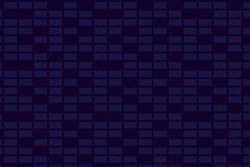

# Memory game

**Code Institute - Second Milestone Project for Interactive Frontend Development**

[View webpage in GitHub Pages](https://github.com/GilleM/Memory-game)

Welcome to my first Code Institute milestone project that you can check out by clicking on the photo below:

[](https://gillem.github.io/Memory-game//)


## Project Description
***
**Memory game** is my second out of four milestone projects at the Code Institute Full Stack Developer course.
The main requirements were to design, develop and implement front-end web application using HTML, CSS and JavaScript. 
It was also required to implement front-end interactivity, using core JavaScript, JavaScript libraries and/or APIs.
Everything needed to be tested  through development, implementation and deployment stages.

According to study of International Psychogeriatrics 2016, 
memory games help sharpen certain  thinking skills that tend to wane with age, such as processing speed, planning skills, 
reaction time, decision making, and short-term memory.

The reason why I decided to go with _Memory game_ is simply because I like fun brain games whose rules is not difficult to understand and follow, but they still require concentration. I am of the opinion that the Memory game project was entertaining and at the same time challenging for a JavaScript beginner, such as I am.


##  User Experience
***

In this paragraph I'm about to provide insight into my UX process, 
focusing on who this website is for, what it is that they want to achieve 
and how my project is the best way to help them achieve these things.

According to [interaction design page](https://www.interaction-design.org/literature/topics/ux-design), user 
experience (UX) design is _"the process design teams use to create products that provide meaningful and relevant 
experiences to users. This involves the design of the entire process of acquiring and integrating the product, 
including aspects of branding, design, usability and function."_


### Project Goals

- to create a website that is fully responsive on mobiles, tablets, laptops and desktops,
- to make a page with interface design, providing a logical structure which is easy to follow (memory board game in the middle of the page, different toggles that help user to information ("How to play?" button)
- to write interactive JavaScript code to produce relevant responses to user's actions (light-dark mode for index page, flipping and matching the card, card counter (flips), timer, music and various overlays depending of the outcome of the game (win or loss))
- to understand the code and to possibly implement it in another project
- to make an interesting, enjoyable page that could be played by children and adults as well and possibly get engaged in some private competition during free time (especially during lock down)

### The business goals of this website is:

- the page could possibly be the part of some company's website or it could contribute to entertaining larger group of 
people by memory card playing

### User Stories

- as a new user who never played memory, I want to have access to the memory rules,
- as a new user, I want to see nicely developed game with logical characteristic (2 matching cards appear, other stay closed)
- as a young user, I want to have more time to find all the cards 
- as a competitive user, I'd like to have different levels of complexity 
- as a user, I'd like the pictures to be nice and funny and the page to be enjoyable. I'd like to have fun with playing it


## Strategy

The main goal of the website is for younger and older generations to have fun playing memory game.
My personal goal was to well understand the JavaScript logic and to prove myself that I could do my first game.


## Scope
My goal in design was to make everything as structured and intuitive as possible. I didn't introduce a lot of text but instead I put the accent on the very interactivity of the page; with images, flipping and matching cards, flip counter, timer, music, overlays, light-night switch button... I have also decided not to introduce any social links since I wanted to have the UX simple, easy to read and to follow.

I certainly had a scope creep with all the features I wanted to add but that weren't agreed on at the starting point. 


## Structure


My users are people wanting to have fun, whether is it about younger or older people, so I needed to make the site concise, simple and fun.
I decided to go with 100vh height and completely omit scroll bar (followed the logic "what is get is what you see").


 _Index.html_ page:
*   **navbar** is always on the top, kept simply white.
Inscription "Memory game" suggest the title of the game itself and there's a toggle light switch button introduced on the right.

* The **central part** is composed of the main photo (that mimics the memory game with some photos open) and two toggle buttons: the one in the center of the page (and picture) that invites users to play the game and the one below with "How to play" inscription.

* **Footer** consists of the basic text, without any social links in order to keep UX simple. The purple color matched the round slider in light switch toggler that is in navbar, so like that I wanted to introduce some "color semantics" into the page.


Other (_easy.html_, _medium.html_ and _hard.html_) pages:
*   Depending on the view, the **navbar** shifts: on the large screens it stays on the left while for the other screens stays on the top. The light switch toggle has been removed and the "Memory game" inscription is changed to "Back to menu".

* The **central part** of the page is composed of the grid of cards which are evenly distribute on the page and are made with full responsiveness so that the data is nicely loaded and presented on the phone, tablet and desktop view.
  - I decided to introduce different back memory card picture for every difficulty, going from the practically plane picture to the one with most details (cherry) that can be seen in the hardest level. The mentioned is done on purpose, to distract a user a bit and to make the game more challenging.
  - The flips are introduced that count how many times the cards have been flipped
  - The timer shows different second for different levels: 120 seconds for beginner, 90 for medium and 60 for hard level.
  - The background is taken from Herro Pattern - "Signal" Pattern

* The **footer** has been completely removed.


## Skeleton       NOT FINISHED!!!!!!!!!!
### Wireframe
I used Balsamiq to developed the wireframes for mobile, tablet and laptop/desktop size. 

You can check them by clicking on one of the following links:


+ [Desktop size](https://gillem.github.io/Memory-game/assets/wireframes/Wireframe_large_screen.html)

+ [Tablet size ](https://gillem.github.io/Memory-game/assets/wireframes/Wireframe_medium_screen.html)

+ [Phone size ](https://gillem.github.io/Memory-game/assets/wireframes/Wireframe_extra_small_screen.html)


## Surface

- color, layout, fonts, images, order and sequence, and the site's identity.

I wanted to give the least amount of information but to pass the correct information. I removed all the additional text or possible content for which I thought would be redudant on the page: the game itself was the most important.

I played with designs and pictures; I certainly wanted to have all the pages vivid and funny but I tried to keep some consistent colors, e.g. the round slider and the footer. I tried to have the right contrast between background and other elements on the page.

In phone responsiveness, I decided to remove the toggle button to make UX more legible.


### Colour Scheme

The patterns are taken from [Hero Patterns](https://www.heropatterns.com/) page. 


The background colors and the patterns for _index.html_ page are the following:

Light mode:
+ color: #daf4f4
+ pattern: Morphing Diamonds

[](https://gillem.github.io/Memory-game//)

Dark mode:
+ color:  #142d2d;
+ pattern: Morphing Diamonds

[](https://gillem.github.io/Memory-game//)

The background colors and the patterns for other pages are the following:

+ color: #12022b
+ pattern: Signal

[](https://gillem.github.io/Memory-game//)


### Typography

Google font _'Hachi Maru Pop'_, used as a main font, looked fun and inviting. It has _sans-serif_ as a back fall.

### Imagery

Pictures taken from [Unsplash site](https://unsplash.com/):
* [Dog wearing Superman costume](https://unsplash.com/photos/7-ToFEHzMNw?utm_source=unsplash&utm_medium=referral&utm_content=creditShareLink) by Elias Castillo, 
* [Doll with a yellow star on the head](https://unsplash.com/photos/RitenbXBHUk?utm_source=unsplash&utm_medium=referral&utm_content=creditShareLink) by Bundo Kim,
* [Lollipop man](https://unsplash.com/photos/UU2PICtxgpA?utm_source=unsplash&utm_medium=referral&utm_content=creditShareLink) by Scott Webb,
* [Mickey Mouse hat](https://unsplash.com/photos/T0wwG1nFoFY?utm_source=unsplash&utm_medium=referral&utm_content=creditShareLink) by Leighann Blackwood,
* [White and blue cat](https://unsplash.com/photos/u3ZUSIH_eis?utm_source=unsplash&utm_medium=referral&utm_content=creditShareLink) by Clayton Robbins, 
* [Cinderella castle](https://unsplash.com/photos/6edUbq-qUZs?utm_source=unsplash&utm_medium=referral&utm_content=creditShareLink) by Brian McGowan,
* [Donald Duck](https://unsplash.com/photos/EGJ-YrqPS8E?utm_source=unsplash&utm_medium=referral&utm_content=creditShareLink) by Kin Li,
* [Nemo](https://unsplash.com/photos/x9yfTxHpj5w?utm_source=unsplash&utm_medium=referral&utm_content=creditShareLink) by David Clode,
* [King Kong](https://unsplash.com/photos/EfASbqkuh2A?utm_source=unsplash&utm_medium=referral&utm_content=creditShareLink) by Third Serving,
* [White wall](https://unsplash.com/photos/4Zaq5xY5M_c?utm_source=unsplash&utm_medium=referral&utm_content=creditShareLink ) as a backround photo by Joe Woods, 
* [Two strawberry dougnut](https://unsplash.com/photos/PFzy4N0_R3M?utm_source=unsplash&utm_medium=referral&utm_content=creditShareLink) as a backround photo by Elena Koycheva,
* [Two cherries](https://unsplash.com/photos/vbAEHCrvXZ0?utm_source=unsplash&utm_medium=referral&utm_content=creditShareLink) as a backround photo by Mae Mu,

Other sources:
* [Casper](https://tvtropes.org/pmwiki/pmwiki.php/WesternAnimation/CasperTheFriendlyGhost) from tvtropes site.
* [Johhny Bravo](https://all-free-download.com/free-vector/download/johnny-bravo-013_49469.html) from all-free-download site.

_Casper_ and _Johnny Bravo_ had their background coloured on [removebg site](https://www.remove.bg/).


### Music
* Background music: [Monkeys Spinning Monkeys](https://www.youtube.com/watch?v=pr42azVZi3o&list=PLya__OBTLMkONuQDu0kHDCrml2xuEINSi&index=5) by Kevin MacLeod,
* [Game over sound](https://www.youtube.com/watch?v=5Wc3kwv0Ddw) taken from _BlittleMcNilsen_ YouTube page;
* [Victory sound](https://www.youtube.com/watch?v=1ZsiEPoRCOs&list=PLuE1RIpYgk-UmLN1jS4Y9AZr_0FjujtfK&index=6) taken from _GFX Sounds_
 YouTube page;

## Features
***

The project practically consists of two different pages: _index.html_ as a main page, from which we can access the game. By opening a modal button, we can choose among three different levels: easy, medium and hard, and for each one I created one html document. They differ in design and in time necessary to finish the game.

**Consistent features across all pages:**

* The navbar always containing "Back to menu",
* Grid with memory card and the same overlays during the game: 
  - "Click here to start" before the games starts,
  - "You won" in case of winning,
  - "You lost" in case of losing.


### Features left to Implement

In the future, I would like:
* introduce more photos for hard level,
* display the highest score (the least flips that have been made),
* introduce some animation on _index.html_ to have the page more dynamic.


## Technologies used
***

**Languages, libraries, frameworks, editors and version control**

* HTML5
  * The language used to create the form and add content to the website.
* CSS3
  * The language used to style the HTML5 elements.
* JavaScript
  * The language used to introduce the interactivity.
* [Bootstrap framework](https://getbootstrap.com/)
  * The project uses **Bootstrap4** to simplify the structure of the website and easily make the website responsive.
  * The project also uses BootstrapCDN to provide icons from [Font Awesome](https://fontawesome.com)
* [Gitpod](https://www.gitpod.io/)
  * I used Gitpod's development environment to write the code for the website
* [Git Version Control](https://git-scm.com/)
  * I used Git for Version Control to record changes and updates to my files
* [GitHub](https://github.com/)
  * I used GitHub’s repository hosting service to host my deployed website as well as track previous versions of my code 

**Other tools used:**

* [Balsamiq](https://balsamiq.com/)
  * I used Balsamiq to create wireframes for my project for large, medium and extra-small views.
* [Google Fonts](https://fonts.google.com/)
* [W3Schools](https://www.w3schools.com/css/default.asp)
  - It was helpful with all my HTML, CSS and Bootstrap issues.
* [Markdown here](https://markdown-here.com/livedemo.html)
  - Markdown editor created by Adam Pritchard
* [Chrome DevTools](https://developers.google.com/web/tools/chrome-devtools)


## Testing   NOT FINISHED!!!!!!!!!!!!!!!
***

**General Testing**   READ AGAIN AND CHANGE GENERAL TESTING SECTION (LIGHTHOUSE)

* Tested all external links opened in a new tab and went to the correct page
* Tested all buttons.
* Tested the responsive behaviour of images and text on desktops, laptops, notebooks and various smartphones.
* Tested the responsivness of the page and 100vh height; there's no overlapping and no scroller introduced
* Reduces and expanded the width of the window to verify that each memory card is distributed in expected way on all device sizes.
* I identified and fixed the majority of problems that were affecting my site's performance, accessibility 
and UX by using open-source Google tool **Lighthouse**. A day before submitting the milestone, performance of
each page exceeded 80%.

**Navbar**

- Changed the screen sizes to verify that the navigation bar is responsive,
- Tested the light switch toggle button; it changed the background color every time upon click,
- Removed the light switch toggle button from phone size, tested it and it isn't there,
- On other pages, "Back to menu" button links _easy.html_, _medium.html_ and _hard.html_ documents to the main _index.html_ page

**Buttons**
- Hovered over buttons and saw the difference in colour,
- Clicked on the button, the modals are working,
- All the button in "Play" button lead to correct pages: _easy.html_, _medium.html_ and _hard.html_ respectively.

**Overlays**
- Tested the responsive behaviour of all three overlays on all devices, they are responsive on every device.

## DO JAVASCRIPT TESTING!!!!!!!!!!!!!!!


## Validation
***
I used **W3C CSS Validation Service** and **W3C Markup Validation Service** to check the validity of the website code.

HTML validation     IT'S WRONG, FIX IT!!!!!!!!!!!!!!!!!!!!!!!!!!!!!!!!!!!!!!!!!!!!!!!!!!!!!!!!
- [index.html](https://validator.w3.org/nu/?doc=https%3A%2F%2Fgillem.github.io%2FMemory-game%2Findex.html)
- [easy.html](https://validator.w3.org/nu/?doc=https%3A%2F%2Fgillem.github.io%2FMemory-game%2Feasy.html)
- [medium.html](https://validator.w3.org/nu/?doc=https%3A%2F%2Fgillem.github.io%2FMemory-game%2Fmedium.html)
- [hard.html](https://validator.w3.org/nu/?doc=https%3A%2F%2Fgillem.github.io%2FMemory-game%2Fhard.html)

CSS validation:

- [style.css](https://jigsaw.w3.org/css-validator/validator?uri=https%3A%2F%2Fgillem.github.io%2FMemory-game%2Fassets%2Fcss%2Fstyle.css&profile=css3svg&usermedium=all&warning=1&vextwarning=&lang=en)
- [style2.css](https://jigsaw.w3.org/css-validator/validator?uri=https%3A%2F%2Fgillem.github.io%2FMemory-game%2Fassets%2Fcss%2Fstyle2.css&profile=css3svg&usermedium=all&warning=1&vextwarning=&lang=en)

For JavaScript validation I used [JSHint](https://jshint.com/) page and validated both JavaScript documents _app.js_ and _app2.js_. The results are as follows:
- For _app.js_:
  - There is only one function in this file.
  - It takes one argument.
  - This function contains 3 statements.
  - Cyclomatic complexity number for this function is 2.
  - One warning all related to availability in ES6.

- For _app2.js_: 
  - There are 28 functions in this file.
  - Function with the largest signature take 2 arguments, while the median is 0.
  - Largest function has 21 statements in it, while the median is 2.5.
  - The most complex function has a cyclomatic complexity value of 6 while the median is 1.
  - 23 warnings - all related to availability in ES6.

DO THE RESPONSIVNESS AND TEST IT THROUGH MOBILE FRIENDLY TEST!!!!!!!!!!!!!!!!!!! :

To test phone responsiveness of each page, I  used [Mobile friendly Test](https://search.google.com/test/mobile-friendly).
All three of the pages passed the test which can be checked by clicking on the following links: [Home page](https://search.google.com/test/mobile-friendly?id=HAcf9Qzh05MQltbkZByFNw),
 [Gallery page](https://search.google.com/test/mobile-friendly?id=zG1pGL1AnIlVCmg_60pdeA) and [Accommodation page](https://search.google.com/test/mobile-friendly?id=z5TcQNYJ91LtQ_hYvbzB1A)


## Deployment
***

This project was developed using the [Gitpod](https://www.gitpod.io/), committed to git and pushed to GitHub using the built in function within git.

To deploy this page to GitHub Pages from its [GitHub repository](https://github.com/AJGreaves/portrait-artist), the following steps were taken:

1. Log into GitHub.
2. From the list of repositories on the screen, select **GilleM/Memory_game**.
3. From the menu items near the top of the page, select **Settings**.
4. Scroll down to the **GitHub Pages** section.
5. Under **Source** click the drop-down menu labelled **None** and select **Master Branch**
6. On selecting Master Branch the page is automatically refreshed, the website is now deployed.
7. Scroll back down to the **GitHub Pages** section to retrieve the link to the deployed website.

**How to run this project locally**

To clone this project into Gitpod you will need:

1. A Github account. [Create a Github account here](https://github.com/)
2. Use the Chrome browser

Then follow these steps:

1. Install the [Gitpod Browser Extentions for Chrome](https://www.gitpod.io/docs/browser-extension/)
2. After installation, restart the browser
3. Log into [Gitpod](https://gitpod.com/) with your gitpod account.
4. Navigate to the [Project GitHub repository](https://github.com/GilleM/Memory-game)
5. Click the green "Gitpod" button in the top right corner of the respository
6. This will trigger a new gitpod workspace to be created from the code in github where you can work locally.

To work on the project code within a local IDE such as VSCode, Pycharm etc:

1. Follow this link to the [Project GitHub repository](https://github.com/GilleM/Memory-game).
2. Under the repository name, click "Clone or download".
3. In the Clone with HTTPs section, copy the clone URL for the repository.
4. In your local IDE open the terminal.
5. Change the current working directory to the location where you want the cloned directory to be made.
6. Type `git clone`, and then paste the URL you copied in Step 3.

```
git clone https://github.com/USERNAME/REPOSITORY
```

1. Press Enter. Your local clone will be created.

Further reading and troubleshooting on cloning a repository from GitHub [here](https://help.github.com/en/articles/cloning-a-repository).


## Credits
***


### Content

FINISH FROM HERE!!!!!!!!!!!!!!!!!!!!!

### Media
The photos used in this site were obtained from the following pages:
- [Unsplash](https://www.lifeinnorway.net/norwegian-mythology-folk-tales/) photo

- [Remove bg site](https://www.remove.bg/) to make a background for some memory card pictures 


### Acknowledgements

- I received inspiration for this project from 

